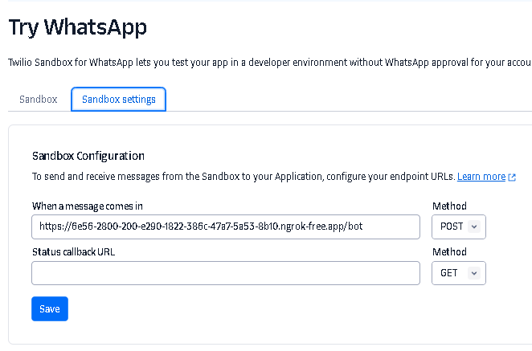

## Deployment

Para desplegar el proyecto es necesario realizar lo siguiente

### 1. Servidor local

```bash
  python app.py
```

### 2. Exponer servidor local

```bash
  ngrok http 5000
```

### 3. Setup de la url

Una vez este desplegado el servidor lo que debemos hacer es utilizar el endpoint de la API url/bot para acceder a las caracteristicas del chat bot, en mi caso utilize NGROK para exponer la ruta local de mi proyecto y asi utilizar el endpoint proporcionado asignandolo en un servicio, en este caso se uso Twilio



## Author

- [@gdaniel159](https://www.github.com/gdaniel159)
